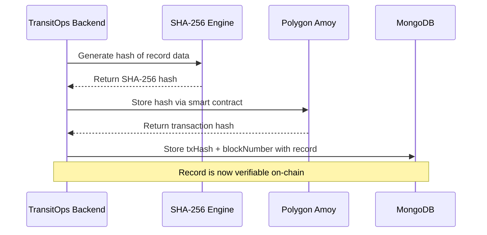
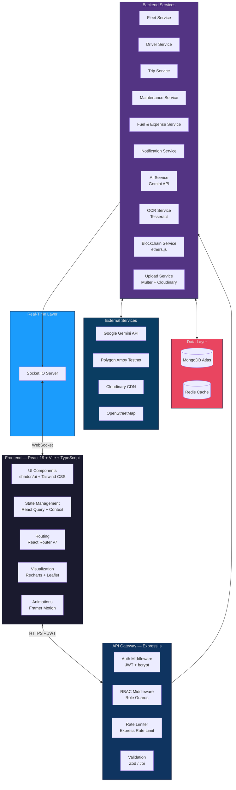
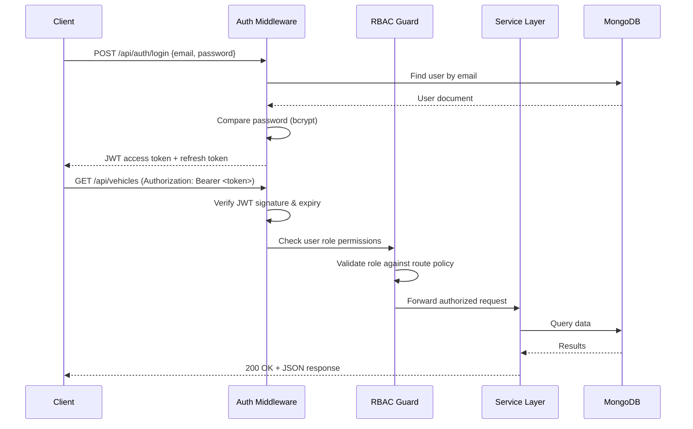
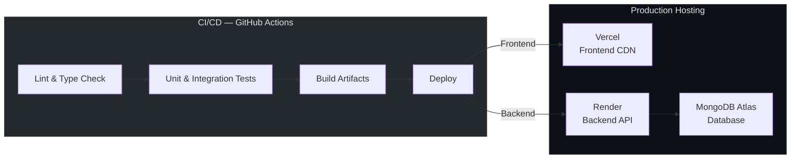
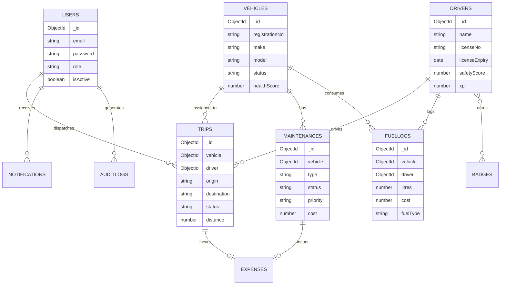
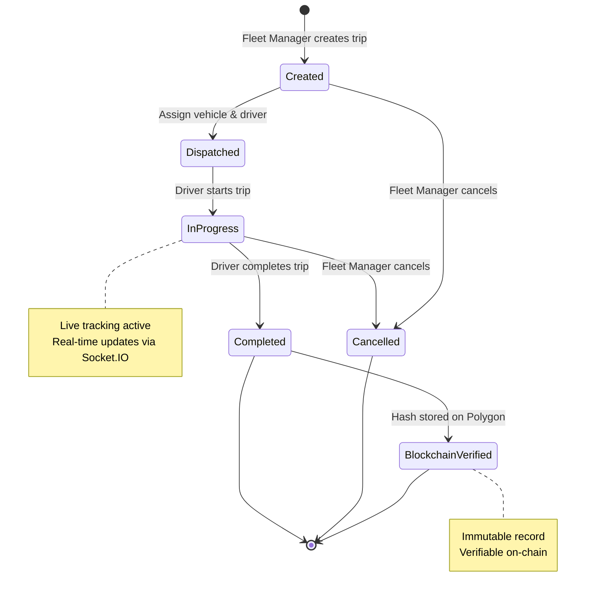
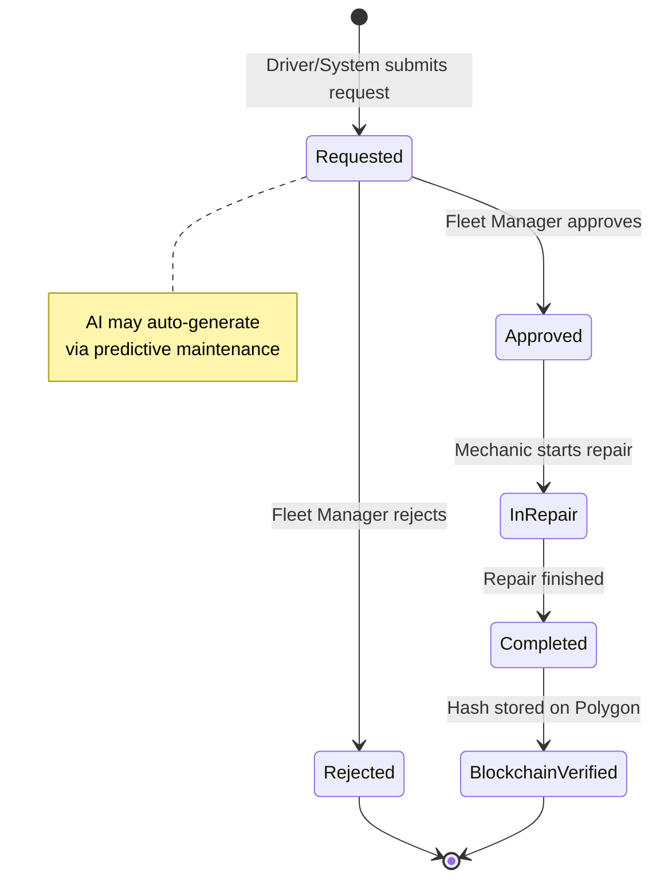

<h1 align="center">TransitOps</h1>
<h3 align="center">AI-Powered Smart Transport Operations Platform</h3>

<p align="center">
  <em>Enterprise Fleet & Transport Operations ERP — built for scale, security, and sustainability.</em>
</p>

<p align="center">
  <a href="https://github.com/AnandRawat11/TransitOPS/actions/workflows/ci.yml">
    
  </a>
  <a href="https://github.com/AnandRawat11/TransitOPS/blob/main/LICENSE">
    
  </a>
  <a href="https://github.com/AnandRawat11/TransitOPS/releases">
    
  </a>
  <a href="https://github.com/AnandRawat11/TransitOPS/stargazers">
    
  </a>
  <a href="https://github.com/AnandRawat11/TransitOPS/issues">
    
  </a>
</p>

<p align="center">
  
  
  
  
  
  
  
  
  
</p>

<p align="center">
  <a href="#-features">Features</a> •
  <a href="#-system-architecture">Architecture</a> •
  <a href="#-getting-started">Getting Started</a> •
  <a href="#-api-reference">API</a> •
  <a href="#-deployment">Deployment</a> •
  <a href="#-contributing">Contributing</a>
</p>

---

## 📖 Table of Contents

- [Project Description](#-project-description)
- [The Business Problem](#-the-business-problem)
- [Why TransitOps](#-why-transitops)
- [Features](#-features)
- [AI Features](#-ai-features)
- [Blockchain Features](#-blockchain-features)
- [Sustainability Features](#-sustainability-features)
- [Screenshots](#-screenshots)
- [System Architecture](#-system-architecture)
- [Folder Structure](#-folder-structure)
- [Database Schema](#-database-schema)
- [API Reference](#-api-reference)
- [Authentication Flow](#-authentication-flow)
- [Role-Based Access Control](#-role-based-access-control)
- [Application Workflow](#-application-workflow)
- [Getting Started](#-getting-started)
- [Docker Setup](#-docker-setup)
- [Environment Variables](#-environment-variables)
- [Local Development](#-local-development)
- [Deployment](#-deployment)
- [Security](#-security)
- [Performance](#-performance)
- [Roadmap](#-roadmap)
- [Contributing](#-contributing)
- [License](#-license)
- [Authors](#-authors)
- [Acknowledgements](#-acknowledgements)

---

## 📋 Project Description

**TransitOps** is a full-stack, enterprise-grade Fleet & Transport Operations ERP platform designed for logistics companies that need to manage vehicles, drivers, trips, maintenance, fuel expenses, compliance, sustainability, and analytics from a single unified dashboard.

The platform combines modern web technologies with AI-powered insights, blockchain-backed audit trails, OCR-based document processing, real-time notifications, and sustainability analytics to deliver a solution that competes with commercial offerings like **Microsoft Dynamics 365 Fleet Management**, **SAP Transportation Management**, and **Oracle Fleet Management**.

### Key Differentiators

| Capability | TransitOps | Legacy Fleet Software |
|:---|:---:|:---:|
| AI-Powered Copilot | ✅ | ❌ |
| Blockchain Audit Trail | ✅ | ❌ |
| Real-Time Dashboards | ✅ | ⚠️ Partial |
| OCR Document Processing | ✅ | ❌ |
| Sustainability Analytics | ✅ | ❌ |
| Role-Based Multi-Dashboard | ✅ | ⚠️ Partial |
| Gamification System | ✅ | ❌ |
| Open Source | ✅ | ❌ |
| Self-Hosted Option | ✅ | ❌ |

---

## 🔍 The Business Problem

Fleet and transport operations face systemic inefficiencies that cost the logistics industry billions annually:

- **Fragmented Systems** — Vehicle tracking, driver management, maintenance scheduling, and expense tracking live in disconnected silos, causing data duplication and blind spots.
- **Reactive Maintenance** — Without predictive analytics, vehicles break down unexpectedly, leading to costly downtime and missed deliveries.
- **Compliance Gaps** — Manual tracking of driver licenses, vehicle inspections, and regulatory documents creates compliance risk.
- **No Audit Trail** — Traditional systems lack tamper-proof records, making dispute resolution and regulatory audits slow and error-prone.
- **Sustainability Blind Spots** — Fleet operators cannot measure, report, or optimize their carbon footprint without purpose-built analytics.
- **Information Overload** — Decision-makers drown in spreadsheets instead of receiving actionable AI-generated insights.

---

## 💡 Why TransitOps

TransitOps was designed from the ground up to address every pain point in modern fleet operations:

1. **Unified Platform** — A single dashboard replaces 5–8 disconnected tools across fleet, driver, trip, maintenance, fuel, and compliance management.
2. **AI-First Architecture** — Gemini-powered copilot delivers natural language queries, predictive maintenance alerts, executive summaries, and vehicle recommendations.
3. **Blockchain-Backed Trust** — Immutable hashes on Polygon ensure tamper-proof records for completed trips, maintenance logs, and expense approvals.
4. **Real-Time Operations** — Socket.IO powers live dashboard updates, instant notifications, and real-time vehicle status tracking.
5. **Enterprise RBAC** — Five distinct user roles with dedicated dashboards, granular permissions, protected routes, and role-scoped APIs.
6. **Sustainability Intelligence** — Built-in carbon tracking, green scores, and eco-driver rankings help organizations meet ESG reporting requirements.
7. **OCR Automation** — Tesseract-powered license scanning eliminates manual data entry and reduces onboarding time by up to 80%.
8. **Gamification** — Driver XP, badges, leaderboards, and champion titles foster engagement and incentivize safe, efficient driving.

---

## ✨ Features

### Core Modules

<table>
<tr>
<td width="50%">

#### 📊 Dashboard
- KPI cards with real-time metrics
- Live fleet status overview
- Fleet health score aggregation
- AI-generated executive summary
- Activity timeline feed
- Sustainability metrics panel

</td>
<td width="50%">

#### 🚛 Vehicle Management
- Full CRUD with search & filters
- QR code generation & scanning
- Vehicle timeline history
- Health score calculation
- Blockchain verification of records

</td>
</tr>
<tr>
<td width="50%">

#### 👤 Driver Management
- Comprehensive driver profiles
- OCR-powered license scanner
- Safety score computation
- License expiry alerts & notifications
- Performance history tracking

</td>
<td width="50%">

#### 🗺️ Trip Management
- Trip creation & dispatch workflow
- Trip completion & cancellation flows
- Live GPS tracking on map
- Route visualization with Leaflet
- Blockchain-verified trip records

</td>
</tr>
<tr>
<td width="50%">

#### 🔧 Maintenance
- Maintenance request submission
- Multi-level approval workflow
- Repair lifecycle management
- AI predictive maintenance alerts
- Vehicle health diagnostics

</td>
<td width="50%">

#### ⛽ Fuel & Expenses
- Fuel log recording & history
- Expense tracking by category
- Cost analytics & trend reports
- ROI calculations per vehicle
- Budget vs. actual comparisons

</td>
</tr>
<tr>
<td width="50%">

#### 🌱 Sustainability
- Carbon emissions calculator
- Fleet green score
- Eco-driver ranking system
- ESG-ready reporting
- Emission trend analysis

</td>
<td width="50%">

#### 🎮 Gamification
- Driver XP progression system
- Achievement badges
- Real-time leaderboards
- Fleet Champion recognition
- Eco Driver awards

</td>
</tr>
</table>

### Real-Time Features

| Feature | Technology | Description |
|:---|:---|:---|
| Live Notifications | Socket.IO | Instant push notifications for all platform events |
| Live Dashboard | Socket.IO + React Query | Auto-refreshing KPIs and fleet status |
| Vehicle Status Updates | WebSocket Events | Real-time vehicle state transitions |
| Maintenance Alerts | Socket.IO + Gemini | AI-triggered predictive maintenance warnings |
| Trip Updates | Socket.IO | Live dispatch, progress, and completion events |

---

## 🤖 AI Features

TransitOps integrates the **Gemini API** to deliver intelligent fleet operations capabilities:

### Fleet Copilot

A conversational AI assistant that responds to natural language queries:

```
User: "Show me all active trips"
Copilot: Displaying 12 active trips across 3 regions...

User: "Which vehicles need maintenance this week?"
Copilot: 4 vehicles flagged — V-1042 (brake wear), V-1087 (oil change due)...

User: "Who is the best driver this month?"
Copilot: Driver Rajesh Kumar — 98.2 safety score, 0 incidents, 14 trips completed...

User: "Generate a weekly operations report"
Copilot: Generating report for July 7–13, 2026...
```

### AI Capabilities

| Capability | Description |
|:---|:---|
| **Executive Summary** | AI-generated daily/weekly operations digest with key metrics and anomalies |
| **Predictive Maintenance** | Analyzes vehicle health data to predict failures before they occur |
| **Vehicle Recommendation** | Suggests optimal vehicle assignments based on trip requirements and fleet condition |
| **Fuel Consumption Analysis** | Identifies fuel inefficiencies and recommends optimization strategies |
| **Natural Language Queries** | Converts plain English questions into data-driven answers |

---

## ⛓️ Blockchain Features

TransitOps uses a **Solidity smart contract** deployed on the **Polygon Amoy Testnet** to create immutable, tamper-proof records:

### What Gets Stored On-Chain

| Record Type | Trigger | Data Hashed |
|:---|:---|:---|
| **Completed Trips** | Trip status → `completed` | Trip ID, vehicle, driver, timestamps, distance, route |
| **Maintenance Records** | Repair status → `completed` | Vehicle ID, repair type, parts, cost, mechanic, date |
| **Expense Approvals** | Expense status → `approved` | Expense ID, amount, category, approver, timestamp |

### How It Works



### Verification Flow

Any record can be independently verified by comparing the locally computed hash against the on-chain hash stored in the smart contract, ensuring complete data integrity.

---

## 🌱 Sustainability Features

TransitOps provides built-in tools for environmental impact measurement and ESG compliance:

- **Carbon Emissions Calculator** — Computes CO₂ output per vehicle, per trip, and fleet-wide based on fuel type, distance, and vehicle efficiency ratings.
- **Fleet Green Score** — An aggregate sustainability rating (0–100) combining fuel efficiency, emissions, idle time, and route optimization.
- **Eco-Driver Ranking** — Ranks drivers by eco-friendly driving behaviors including smooth acceleration, optimal speed maintenance, and minimal idle time.
- **Emission Trend Analysis** — Historical charts showing emission patterns over time with AI-generated reduction recommendations.
- **ESG Reporting** — Export-ready sustainability data formatted for Environmental, Social, and Governance reporting requirements.

---

## 📸 Screenshots

> **Note:** Replace the placeholder paths below with actual screenshots of your deployed application.

<details>
<summary><strong>🖥️ Dashboard</strong></summary>
<br />
<p align="center">
  
</p>
</details>

<details>
<summary><strong>🚛 Vehicle Management</strong></summary>
<br />
<p align="center">
  
</p>
</details>

<details>
<summary><strong>👤 Driver Management</strong></summary>
<br />
<p align="center">
  
</p>
</details>

<details>
<summary><strong>🗺️ Trip Tracking</strong></summary>
<br />
<p align="center">
  
</p>
</details>

<details>
<summary><strong>🤖 AI Copilot</strong></summary>
<br />
<p align="center">
  
</p>
</details>

<details>
<summary><strong>⛓️ Blockchain Verification</strong></summary>
<br />
<p align="center">
  
</p>
</details>

<details>
<summary><strong>🌱 Sustainability Dashboard</strong></summary>
<br />
<p align="center">
  
</p>
</details>

---

## 🏗️ System Architecture

### High-Level Overview



### Authentication & Authorization Flow



### Deployment Architecture



---

## 📁 Folder Structure

### Root

```
TransitOps/
│
├── client/                    # React 19 frontend application
├── server/                    # Express.js backend API
├── smart-contract/            # Solidity smart contract + deployment scripts
├── docs/                      # Documentation, assets, and screenshots
│   ├── assets/                # Banner, logo, and brand assets
│   ├── screenshots/           # Application screenshots
│   └── api/                   # API documentation (Postman, Swagger)
├── docker/                    # Dockerfiles for client and server
│   ├── client.Dockerfile
│   └── server.Dockerfile
├── .github/                   # GitHub Actions workflows and templates
│   ├── workflows/
│   │   ├── ci.yml
│   │   └── deploy.yml
│   ├── ISSUE_TEMPLATE/
│   └── PULL_REQUEST_TEMPLATE.md
├── .env.example               # Environment variable template
├── docker-compose.yml         # Multi-container orchestration
├── package.json               # Root workspace configuration
├── LICENSE                    # Project license
└── README.md                  # This file
```

### Frontend (`client/`)

```
client/
├── public/
│   ├── favicon.ico
│   └── manifest.json
├── src/
│   ├── api/                       # API client configuration & request functions
│   │   ├── axios.ts               # Axios instance with interceptors
│   │   ├── auth.api.ts
│   │   ├── vehicles.api.ts
│   │   ├── drivers.api.ts
│   │   ├── trips.api.ts
│   │   ├── maintenance.api.ts
│   │   ├── fuel.api.ts
│   │   └── blockchain.api.ts
│   ├── assets/                    # Static assets (images, fonts, icons)
│   ├── components/                # Reusable UI components
│   │   ├── ui/                    # shadcn/ui primitives
│   │   │   ├── button.tsx
│   │   │   ├── card.tsx
│   │   │   ├── dialog.tsx
│   │   │   ├── data-table.tsx
│   │   │   ├── dropdown-menu.tsx
│   │   │   ├── input.tsx
│   │   │   ├── select.tsx
│   │   │   ├── sheet.tsx
│   │   │   ├── skeleton.tsx
│   │   │   ├── table.tsx
│   │   │   ├── tabs.tsx
│   │   │   └── toast.tsx
│   │   ├── layout/                # Layout components
│   │   │   ├── AppLayout.tsx
│   │   │   ├── Sidebar.tsx
│   │   │   ├── Header.tsx
│   │   │   └── Footer.tsx
│   │   ├── dashboard/             # Dashboard widgets
│   │   │   ├── KPICard.tsx
│   │   │   ├── FleetStatus.tsx
│   │   │   ├── HealthScore.tsx
│   │   │   ├── AISummary.tsx
│   │   │   ├── ActivityTimeline.tsx
│   │   │   └── SustainabilityPanel.tsx
│   │   ├── vehicles/              # Vehicle module components
│   │   ├── drivers/               # Driver module components
│   │   ├── trips/                 # Trip module components
│   │   ├── maintenance/           # Maintenance module components
│   │   ├── fuel/                  # Fuel & expense components
│   │   ├── sustainability/        # Sustainability components
│   │   ├── copilot/               # AI Copilot interface
│   │   ├── blockchain/            # Blockchain verification UI
│   │   ├── gamification/          # Gamification components
│   │   └── common/                # Shared components
│   │       ├── ProtectedRoute.tsx
│   │       ├── RoleGuard.tsx
│   │       ├── LoadingSpinner.tsx
│   │       ├── ErrorBoundary.tsx
│   │       ├── EmptyState.tsx
│   │       └── ConfirmDialog.tsx
│   ├── contexts/                  # React context providers
│   │   ├── AuthContext.tsx
│   │   ├── SocketContext.tsx
│   │   ├── ThemeContext.tsx
│   │   └── NotificationContext.tsx
│   ├── hooks/                     # Custom React hooks
│   │   ├── useAuth.ts
│   │   ├── useSocket.ts
│   │   ├── useVehicles.ts
│   │   ├── useDrivers.ts
│   │   ├── useTrips.ts
│   │   └── useDebounce.ts
│   ├── lib/                       # Utility libraries
│   │   ├── utils.ts
│   │   ├── constants.ts
│   │   ├── validators.ts
│   │   └── formatters.ts
│   ├── pages/                     # Route-level page components
│   │   ├── auth/
│   │   │   ├── LoginPage.tsx
│   │   │   └── ForgotPasswordPage.tsx
│   │   ├── dashboard/
│   │   │   ├── AdminDashboard.tsx
│   │   │   ├── FleetManagerDashboard.tsx
│   │   │   ├── DriverDashboard.tsx
│   │   │   ├── SafetyOfficerDashboard.tsx
│   │   │   └── FinancialAnalystDashboard.tsx
│   │   ├── vehicles/
│   │   ├── drivers/
│   │   ├── trips/
│   │   ├── maintenance/
│   │   ├── fuel/
│   │   ├── sustainability/
│   │   ├── copilot/
│   │   └── NotFoundPage.tsx
│   ├── routes/                    # Route configuration
│   │   ├── index.tsx
│   │   ├── ProtectedRoutes.tsx
│   │   └── roleRoutes.ts
│   ├── services/                  # Business logic services
│   │   ├── socket.service.ts
│   │   └── notification.service.ts
│   ├── types/                     # TypeScript type definitions
│   │   ├── auth.types.ts
│   │   ├── vehicle.types.ts
│   │   ├── driver.types.ts
│   │   ├── trip.types.ts
│   │   ├── maintenance.types.ts
│   │   ├── fuel.types.ts
│   │   └── api.types.ts
│   ├── App.tsx                    # Root application component
│   ├── main.tsx                   # Application entry point
│   └── index.css                  # Global styles + Tailwind directives
├── components.json                # shadcn/ui configuration
├── tailwind.config.ts             # Tailwind CSS configuration
├── tsconfig.json                  # TypeScript configuration
├── vite.config.ts                 # Vite build configuration
├── postcss.config.js              # PostCSS configuration
└── package.json                   # Frontend dependencies
```

### Backend (`server/`)

```
server/
├── src/
│   ├── config/                    # Application configuration
│   │   ├── db.js                  # MongoDB connection setup
│   │   ├── cloudinary.js          # Cloudinary SDK configuration
│   │   ├── socket.js              # Socket.IO initialization
│   │   └── env.js                 # Environment variable validation
│   ├── controllers/               # Route handler logic
│   │   ├── auth.controller.js
│   │   ├── vehicle.controller.js
│   │   ├── driver.controller.js
│   │   ├── trip.controller.js
│   │   ├── maintenance.controller.js
│   │   ├── fuel.controller.js
│   │   ├── expense.controller.js
│   │   ├── sustainability.controller.js
│   │   ├── copilot.controller.js
│   │   ├── blockchain.controller.js
│   │   ├── notification.controller.js
│   │   ├── dashboard.controller.js
│   │   └── gamification.controller.js
│   ├── middleware/                 # Express middleware
│   │   ├── auth.middleware.js      # JWT verification
│   │   ├── rbac.middleware.js      # Role-based access control
│   │   ├── validate.middleware.js  # Request validation
│   │   ├── upload.middleware.js    # Multer file upload
│   │   ├── rateLimiter.js         # API rate limiting
│   │   └── errorHandler.js        # Global error handler
│   ├── models/                    # Mongoose schemas & models
│   │   ├── User.model.js
│   │   ├── Vehicle.model.js
│   │   ├── Driver.model.js
│   │   ├── Trip.model.js
│   │   ├── Maintenance.model.js
│   │   ├── FuelLog.model.js
│   │   ├── Expense.model.js
│   │   ├── Notification.model.js
│   │   ├── AuditLog.model.js
│   │   └── Badge.model.js
│   ├── routes/                    # Express route definitions
│   │   ├── auth.routes.js
│   │   ├── vehicle.routes.js
│   │   ├── driver.routes.js
│   │   ├── trip.routes.js
│   │   ├── maintenance.routes.js
│   │   ├── fuel.routes.js
│   │   ├── expense.routes.js
│   │   ├── sustainability.routes.js
│   │   ├── copilot.routes.js
│   │   ├── blockchain.routes.js
│   │   ├── notification.routes.js
│   │   ├── dashboard.routes.js
│   │   └── gamification.routes.js
│   ├── services/                  # Business logic layer
│   │   ├── auth.service.js
│   │   ├── vehicle.service.js
│   │   ├── driver.service.js
│   │   ├── trip.service.js
│   │   ├── maintenance.service.js
│   │   ├── fuel.service.js
│   │   ├── ai.service.js          # Gemini API integration
│   │   ├── ocr.service.js         # Tesseract OCR processing
│   │   ├── blockchain.service.js  # Smart contract interactions
│   │   ├── upload.service.js      # Cloudinary uploads
│   │   ├── notification.service.js
│   │   ├── sustainability.service.js
│   │   └── gamification.service.js
│   ├── utils/                     # Utility functions
│   │   ├── logger.js
│   │   ├── apiResponse.js
│   │   ├── apiError.js
│   │   ├── hashUtils.js
│   │   └── dateUtils.js
│   ├── validators/                # Request validation schemas
│   │   ├── auth.validator.js
│   │   ├── vehicle.validator.js
│   │   ├── driver.validator.js
│   │   └── trip.validator.js
│   ├── jobs/                      # Background jobs & schedulers
│   │   ├── maintenanceCheck.job.js
│   │   ├── licenseExpiry.job.js
│   │   └── sustainabilityCalc.job.js
│   ├── app.js                     # Express app initialization
│   └── server.js                  # Server entry point
├── tests/                         # Test suites
│   ├── unit/
│   ├── integration/
│   └── fixtures/
├── .env.example                   # Environment variable template
└── package.json                   # Backend dependencies
```

### Smart Contract (`smart-contract/`)

```
smart-contract/
├── contracts/
│   └── TransitOpsAudit.sol        # Solidity audit trail contract
├── scripts/
│   └── deploy.js                  # Deployment script
├── test/
│   └── TransitOpsAudit.test.js    # Contract test suite
├── hardhat.config.js              # Hardhat configuration
└── package.json
```

---

## 🗄️ Database Schema

### MongoDB Collections

| Collection | Description | Key Fields |
|:---|:---|:---|
| `users` | Platform users with role assignments | `email`, `password`, `role`, `isActive`, `lastLogin` |
| `vehicles` | Fleet vehicle registry | `registrationNo`, `make`, `model`, `status`, `healthScore`, `blockchainTxHash` |
| `drivers` | Driver profiles and credentials | `name`, `licenseNo`, `licenseExpiry`, `safetyScore`, `xp`, `badges` |
| `trips` | Trip lifecycle records | `vehicle`, `driver`, `origin`, `destination`, `status`, `distance`, `blockchainTxHash` |
| `maintenances` | Maintenance request & repair records | `vehicle`, `type`, `status`, `priority`, `cost`, `predictedDate` |
| `fuellogs` | Fuel fill-up records | `vehicle`, `driver`, `litres`, `cost`, `odometer`, `fuelType` |
| `expenses` | Operational expense records | `category`, `amount`, `status`, `approvedBy`, `blockchainTxHash` |
| `notifications` | In-app notification records | `user`, `type`, `message`, `isRead`, `metadata` |
| `auditlogs` | System-wide audit trail | `action`, `user`, `resource`, `changes`, `ipAddress` |
| `badges` | Gamification badge definitions | `name`, `description`, `criteria`, `icon`, `xpReward` |

### Entity Relationship Diagram



---

## 🔌 API Reference

### Base URL

```
Production:  https://api.transitops.example.com/api/v1
Development: http://localhost:5000/api/v1
```

### Authentication

| Method | Endpoint | Description | Access |
|:---|:---|:---|:---|
| `POST` | `/auth/register` | Register a new user | Public |
| `POST` | `/auth/login` | Authenticate and receive JWT | Public |
| `POST` | `/auth/refresh` | Refresh access token | Authenticated |
| `POST` | `/auth/logout` | Invalidate session | Authenticated |
| `GET` | `/auth/me` | Get current user profile | Authenticated |

### Vehicles

| Method | Endpoint | Description | Access |
|:---|:---|:---|:---|
| `GET` | `/vehicles` | List all vehicles (paginated) | Admin, Fleet Manager |
| `GET` | `/vehicles/:id` | Get vehicle details | Admin, Fleet Manager |
| `POST` | `/vehicles` | Create a new vehicle | Admin |
| `PUT` | `/vehicles/:id` | Update vehicle details | Admin, Fleet Manager |
| `DELETE` | `/vehicles/:id` | Soft-delete a vehicle | Admin |
| `GET` | `/vehicles/:id/timeline` | Get vehicle event timeline | Admin, Fleet Manager |
| `GET` | `/vehicles/:id/health` | Get vehicle health score | Admin, Fleet Manager |
| `POST` | `/vehicles/:id/qr` | Generate QR code | Admin, Fleet Manager |

### Drivers

| Method | Endpoint | Description | Access |
|:---|:---|:---|:---|
| `GET` | `/drivers` | List all drivers | Admin, Fleet Manager, Safety Officer |
| `GET` | `/drivers/:id` | Get driver profile | Admin, Fleet Manager |
| `POST` | `/drivers` | Create driver profile | Admin |
| `PUT` | `/drivers/:id` | Update driver profile | Admin, Fleet Manager |
| `POST` | `/drivers/scan-license` | OCR license scan | Admin, Fleet Manager |
| `GET` | `/drivers/:id/safety-score` | Get driver safety score | Admin, Safety Officer |

### Trips

| Method | Endpoint | Description | Access |
|:---|:---|:---|:---|
| `GET` | `/trips` | List all trips | Admin, Fleet Manager |
| `GET` | `/trips/:id` | Get trip details | Authenticated |
| `POST` | `/trips` | Create a new trip | Admin, Fleet Manager |
| `PUT` | `/trips/:id/dispatch` | Dispatch a trip | Fleet Manager |
| `PUT` | `/trips/:id/complete` | Mark trip as completed | Driver, Fleet Manager |
| `PUT` | `/trips/:id/cancel` | Cancel a trip | Admin, Fleet Manager |
| `GET` | `/trips/:id/track` | Get live tracking data | Authenticated |

### Maintenance

| Method | Endpoint | Description | Access |
|:---|:---|:---|:---|
| `GET` | `/maintenance` | List maintenance records | Admin, Fleet Manager |
| `POST` | `/maintenance` | Submit maintenance request | Authenticated |
| `PUT` | `/maintenance/:id/approve` | Approve maintenance request | Admin, Fleet Manager |
| `PUT` | `/maintenance/:id/complete` | Mark repair as complete | Fleet Manager |
| `GET` | `/maintenance/predictions` | Get AI maintenance predictions | Admin, Fleet Manager |

### Fuel & Expenses

| Method | Endpoint | Description | Access |
|:---|:---|:---|:---|
| `GET` | `/fuel` | List fuel logs | Admin, Fleet Manager, Financial Analyst |
| `POST` | `/fuel` | Log fuel fill-up | Driver, Fleet Manager |
| `GET` | `/expenses` | List expenses | Admin, Financial Analyst |
| `POST` | `/expenses` | Create expense record | Authenticated |
| `PUT` | `/expenses/:id/approve` | Approve expense | Admin, Financial Analyst |
| `GET` | `/expenses/analytics` | Get cost analytics | Admin, Financial Analyst |

### AI Copilot

| Method | Endpoint | Description | Access |
|:---|:---|:---|:---|
| `POST` | `/copilot/query` | Send natural language query | Authenticated |
| `GET` | `/copilot/summary` | Get AI executive summary | Admin, Fleet Manager |
| `GET` | `/copilot/predictions` | Get predictive insights | Admin, Fleet Manager |

### Blockchain

| Method | Endpoint | Description | Access |
|:---|:---|:---|:---|
| `GET` | `/blockchain/verify/:txHash` | Verify a record on-chain | Authenticated |
| `GET` | `/blockchain/records` | List all blockchain records | Admin |

### Sustainability

| Method | Endpoint | Description | Access |
|:---|:---|:---|:---|
| `GET` | `/sustainability/emissions` | Get carbon emission data | Admin, Fleet Manager |
| `GET` | `/sustainability/green-score` | Get fleet green score | Admin, Fleet Manager |
| `GET` | `/sustainability/eco-ranking` | Get eco-driver rankings | Admin, Safety Officer |

### Gamification

| Method | Endpoint | Description | Access |
|:---|:---|:---|:---|
| `GET` | `/gamification/leaderboard` | Get driver leaderboard | Authenticated |
| `GET` | `/gamification/badges` | List available badges | Authenticated |
| `GET` | `/gamification/profile/:driverId` | Get driver gamification profile | Authenticated |

### Dashboard

| Method | Endpoint | Description | Access |
|:---|:---|:---|:---|
| `GET` | `/dashboard/admin` | Admin dashboard KPIs | Admin |
| `GET` | `/dashboard/fleet-manager` | Fleet manager metrics | Fleet Manager |
| `GET` | `/dashboard/driver` | Driver personal dashboard | Driver |
| `GET` | `/dashboard/safety` | Safety overview metrics | Safety Officer |
| `GET` | `/dashboard/financial` | Financial analytics | Financial Analyst |

---

## 🔐 Authentication Flow

```mermaid
flowchart TD
    A[User visits /login] --> B{Has valid token?}
    B -->|Yes| C[Redirect to role dashboard]
    B -->|No| D[Show login form]
    D --> E[Submit credentials]
    E --> F[POST /api/v1/auth/login]
    F --> G{Valid credentials?}
    G -->|No| H[Show error message]
    H --> D
    G -->|Yes| I[Generate JWT + Refresh Token]
    I --> J[Store tokens in httpOnly cookies]
    J --> K[Return user profile + role]
    K --> L{Route by role}
    L -->|Admin| M[/dashboard/admin]
    L -->|Fleet Manager| N[/dashboard/fleet]
    L -->|Driver| O[/dashboard/driver]
    L -->|Safety Officer| P[/dashboard/safety]
    L -->|Financial Analyst| Q[/dashboard/finance]

    style A fill:#1a1a2e,stroke:#e94560,color:#eee
    style I fill:#533483,stroke:#e94560,color:#eee
    style L fill:#0f3460,stroke:#e94560,color:#eee
```

---

## 🛡️ Role-Based Access Control

### Role Definitions

| Role | Dashboard | Scope | Key Permissions |
|:---|:---|:---|:---|
| **Admin** | Admin Dashboard | Full system access | All CRUD, user management, approvals, system config |
| **Fleet Manager** | Fleet Dashboard | Vehicle & trip operations | Vehicle CRUD, trip dispatch, maintenance approval, driver assignment |
| **Driver** | Driver Dashboard | Personal scope | View assigned trips, log fuel, submit maintenance requests, view own stats |
| **Safety Officer** | Safety Dashboard | Safety & compliance | Driver safety scores, incident reports, compliance audits, license monitoring |
| **Financial Analyst** | Finance Dashboard | Financial scope | Expense approvals, cost analytics, fuel reports, ROI calculations, budget tracking |

### Permission Matrix

| Resource | Admin | Fleet Manager | Driver | Safety Officer | Financial Analyst |
|:---|:---:|:---:|:---:|:---:|:---:|
| **Users** | CRUD | Read | Self | Read | Read |
| **Vehicles** | CRUD | CRUD | Read | Read | Read |
| **Drivers** | CRUD | Read/Update | Self | Read | Read |
| **Trips** | CRUD | CRUD | Read/Update | Read | Read |
| **Maintenance** | CRUD | CRUD | Create/Read | Read | Read |
| **Fuel Logs** | CRUD | CRUD | Create/Read | Read | Read |
| **Expenses** | CRUD | Create/Read | Create/Read | Read | CRUD |
| **Sustainability** | Read | Read | — | Read | Read |
| **AI Copilot** | Full | Full | Limited | Limited | Limited |
| **Blockchain** | Full | Read | Read | Read | Read |
| **Gamification** | Full | Read | Self | Read | — |

### Implementation

```javascript
// middleware/rbac.middleware.js
const authorize = (...allowedRoles) => {
  return (req, res, next) => {
    if (!req.user) {
      return res.status(401).json({ message: 'Authentication required' });
    }
    if (!allowedRoles.includes(req.user.role)) {
      return res.status(403).json({ message: 'Insufficient permissions' });
    }
    next();
  };
};

// Usage in routes
router.get('/vehicles', auth, authorize('admin', 'fleet_manager'), getVehicles);
router.delete('/vehicles/:id', auth, authorize('admin'), deleteVehicle);
```

---

## 🔄 Application Workflow

### Trip Lifecycle



### Maintenance Workflow



---

## 🚀 Getting Started

### Prerequisites

| Tool | Minimum Version | Purpose |
|:---|:---|:---|
| [Node.js](https://nodejs.org/) | v20.x LTS | JavaScript runtime |
| [npm](https://www.npmjs.com/) | v10.x | Package manager |
| [MongoDB](https://www.mongodb.com/) | v7.x | Database (or use Atlas) |
| [Git](https://git-scm.com/) | v2.x | Version control |
| [Docker](https://www.docker.com/) | v24.x | Containerization (optional) |

### Quick Start

```bash
# 1. Clone the repository
git clone https://github.com/AnandRawat11/TransitOPS.git
cd TransitOPS

# 2. Install dependencies
npm install          # Root workspace
cd client && npm install && cd ..
cd server && npm install && cd ..

# 3. Configure environment variables
cp .env.example .env
# Edit .env with your credentials (see Environment Variables section)

# 4. Start development servers
# Terminal 1 — Backend
cd server && npm run dev

# Terminal 2 — Frontend
cd client && npm run dev

# 5. Open the application
# Frontend: http://localhost:5173
# Backend:  http://localhost:5000
```

---

## 🐳 Docker Setup

### Using Docker Compose (Recommended)

```bash
# Build and start all services
docker-compose up --build

# Run in background
docker-compose up --build -d

# Stop all services
docker-compose down

# Stop and remove volumes
docker-compose down -v
```

### `docker-compose.yml`

```yaml
version: '3.9'

services:
  client:
    build:
      context: .
      dockerfile: docker/client.Dockerfile
    ports:
      - "5173:5173"
    environment:
      - VITE_API_URL=http://localhost:5000/api/v1
    depends_on:
      - server

  server:
    build:
      context: .
      dockerfile: docker/server.Dockerfile
    ports:
      - "5000:5000"
    env_file:
      - .env
    depends_on:
      - mongo

  mongo:
    image: mongo:8
    ports:
      - "27017:27017"
    volumes:
      - mongo_data:/data/db
    environment:
      MONGO_INITDB_ROOT_USERNAME: ${MONGO_USER}
      MONGO_INITDB_ROOT_PASSWORD: ${MONGO_PASSWORD}

volumes:
  mongo_data:
```

---

## 🔑 Environment Variables

Create a `.env` file in the project root using `.env.example` as a template:

```bash
# ──────────────────────────────────────
# Server
# ──────────────────────────────────────
NODE_ENV=development
PORT=5000

# ──────────────────────────────────────
# Database
# ──────────────────────────────────────
MONGODB_URI=mongodb+srv://<username>:<password>@cluster.mongodb.net/transitops?retryWrites=true&w=majority

# ──────────────────────────────────────
# Authentication
# ──────────────────────────────────────
JWT_SECRET=your_jwt_secret_key_min_32_chars
JWT_EXPIRES_IN=7d
JWT_REFRESH_SECRET=your_refresh_secret_key_min_32_chars
JWT_REFRESH_EXPIRES_IN=30d

# ──────────────────────────────────────
# Cloudinary (Image Uploads)
# ──────────────────────────────────────
CLOUDINARY_CLOUD_NAME=your_cloud_name
CLOUDINARY_API_KEY=your_api_key
CLOUDINARY_API_SECRET=your_api_secret

# ──────────────────────────────────────
# Google Gemini AI
# ──────────────────────────────────────
GEMINI_API_KEY=your_gemini_api_key

# ──────────────────────────────────────
# Blockchain (Polygon Amoy Testnet)
# ──────────────────────────────────────
POLYGON_RPC_URL=https://rpc-amoy.polygon.technology
WALLET_PRIVATE_KEY=your_wallet_private_key
CONTRACT_ADDRESS=your_deployed_contract_address

# ──────────────────────────────────────
# Frontend (Vite)
# ──────────────────────────────────────
VITE_API_URL=http://localhost:5000/api/v1
VITE_SOCKET_URL=http://localhost:5000
```

> **⚠️ Security Notice:** Never commit `.env` files to version control. The `.gitignore` file is pre-configured to exclude all `.env` files.

---

## 💻 Local Development

### Available Scripts

#### Root

| Command | Description |
|:---|:---|
| `npm run dev` | Start both client and server concurrently |
| `npm run dev:client` | Start frontend development server |
| `npm run dev:server` | Start backend development server |
| `npm run build` | Build both client and server |
| `npm run lint` | Lint all workspaces |

#### Client (`client/`)

| Command | Description |
|:---|:---|
| `npm run dev` | Start Vite dev server on port 5173 |
| `npm run build` | Production build to `dist/` |
| `npm run preview` | Preview production build locally |
| `npm run lint` | Run ESLint |
| `npm run type-check` | Run TypeScript compiler check |

#### Server (`server/`)

| Command | Description |
|:---|:---|
| `npm run dev` | Start with nodemon (hot reload) |
| `npm start` | Start production server |
| `npm test` | Run test suite |
| `npm run test:coverage` | Run tests with coverage report |
| `npm run seed` | Seed database with sample data |

### Development Tips

- **Hot Reload** — Both frontend (Vite HMR) and backend (nodemon) support hot reload.
- **API Proxy** — Vite is configured to proxy `/api` requests to the backend during development.
- **Database Seeding** — Run `npm run seed` in the server directory to populate MongoDB with sample vehicles, drivers, trips, and users for testing.

---

## 🌐 Deployment

### Frontend — Vercel

```bash
# Install Vercel CLI
npm install -g vercel

# Deploy from the client directory
cd client
vercel --prod
```

**Vercel Configuration** (`vercel.json`):

```json
{
  "buildCommand": "npm run build",
  "outputDirectory": "dist",
  "framework": "vite",
  "rewrites": [
    { "source": "/(.*)", "destination": "/index.html" }
  ]
}
```

### Backend — Render

1. Connect your GitHub repository to [Render](https://render.com).
2. Create a new **Web Service** with the following settings:

| Setting | Value |
|:---|:---|
| **Root Directory** | `server` |
| **Build Command** | `npm install` |
| **Start Command** | `npm start` |
| **Runtime** | Node |
| **Plan** | Free / Starter |

3. Add all environment variables from the `.env` file in the Render dashboard.

### Database — MongoDB Atlas

1. Create a free cluster at [MongoDB Atlas](https://www.mongodb.com/atlas).
2. Whitelist your server IP (or `0.0.0.0/0` for development).
3. Create a database user and update `MONGODB_URI` in your environment variables.

### Smart Contract — Polygon Amoy

```bash
cd smart-contract

# Install dependencies
npm install

# Compile the contract
npx hardhat compile

# Deploy to Polygon Amoy Testnet
npx hardhat run scripts/deploy.js --network amoy

# Note the deployed contract address and update CONTRACT_ADDRESS in .env
```

---

## 🔒 Security

TransitOps implements defense-in-depth security across every layer:

| Layer | Implementation |
|:---|:---|
| **Authentication** | JWT with httpOnly cookies, refresh token rotation, bcrypt password hashing (12 salt rounds) |
| **Authorization** | Role-based middleware guards on every protected route |
| **Input Validation** | Zod / Joi schema validation on all request bodies, params, and queries |
| **Rate Limiting** | Express rate limiter to prevent brute-force and DDoS attacks |
| **CORS** | Strict origin whitelist — only configured domains can access the API |
| **Helmet** | HTTP security headers (CSP, HSTS, X-Frame-Options, etc.) |
| **Data Sanitization** | MongoDB query injection prevention via `express-mongo-sanitize` |
| **XSS Protection** | Input sanitization via `xss-clean` |
| **File Upload** | MIME type validation, size limits, and Cloudinary-only storage |
| **Blockchain Integrity** | SHA-256 hashing with on-chain verification for tamper detection |
| **Environment Variables** | Secrets managed via `.env` files, never committed to source control |
| **Audit Logging** | Every state-changing operation is logged with user, timestamp, IP, and changes |

---

## ⚡ Performance

| Optimization | Description |
|:---|:---|
| **React Query Caching** | Intelligent server-state caching with configurable stale times and background refetching |
| **Code Splitting** | Route-based lazy loading via `React.lazy()` and `Suspense` |
| **Vite Build** | Tree-shaking, minification, and chunk splitting for optimal bundle sizes |
| **Database Indexing** | Compound and single-field indexes on frequently queried fields |
| **Pagination** | Cursor-based pagination for large collections (vehicles, trips, logs) |
| **Image Optimization** | Cloudinary transformations for responsive images and WebP delivery |
| **Gzip Compression** | Express compression middleware for reduced payload sizes |
| **Debounced Search** | Client-side debouncing to minimize API calls during user input |
| **Socket.IO Rooms** | Targeted event broadcasting to reduce unnecessary client updates |
| **Skeleton Loading** | Perceived performance improvement with skeleton screens during data fetching |

---

## 🔮 Future Scope

| Feature | Description | Priority |
|:---|:---|:---:|
| **Mobile App** | React Native companion app for drivers with offline support | High |
| **Multi-Tenancy** | Organization-level isolation for SaaS deployment | High |
| **Advanced Analytics** | Custom report builder with exportable dashboards | Medium |
| **Geofencing** | Virtual boundary alerts for vehicles entering/leaving designated zones | Medium |
| **ELD Integration** | Electronic Logging Device compliance for hours-of-service tracking | Medium |
| **Fuel Card Integration** | Direct API integration with fuel card providers (WEX, Fleetcor) | Medium |
| **Telematics** | OBD-II device integration for real-time vehicle diagnostics | Low |
| **Multi-Language** | i18n support for international deployment | Low |
| **White-Label** | Customizable branding for enterprise clients | Low |

---

## 🗺️ Roadmap

```mermaid
gantt
    title TransitOps Development Roadmap
    dateFormat YYYY-Q
    axisFormat %Y Q%q

    section Foundation
    Core Architecture & Auth        :done, 2025-Q3, 2025-Q4
    Vehicle & Driver Management     :done, 2025-Q4, 2026-Q1
    Trip Management & Tracking      :done, 2026-Q1, 2026-Q2

    section Intelligence
    AI Copilot Integration          :active, 2026-Q2, 2026-Q3
    Predictive Maintenance          :active, 2026-Q2, 2026-Q3
    Blockchain Audit Trail          :active, 2026-Q2, 2026-Q3

    section Scale
    Multi-Tenancy                   :2026-Q3, 2026-Q4
    Mobile App (React Native)       :2026-Q3, 2027-Q1
    Advanced Analytics Engine       :2026-Q4, 2027-Q1

    section Enterprise
    ELD & Telematics Integration    :2027-Q1, 2027-Q2
    White-Label & i18n              :2027-Q2, 2027-Q3
    SOC 2 Compliance                :2027-Q2, 2027-Q3
```

## 🌿 Branch Strategy

For the collaborative development of TransitOps, team members will develop their modules in isolation on the following designated feature branches before merging them into `main`:

- `feature/auth-vehicle` (Assigned to: **Anand Rawat**)
- `feature/driver-dashboard` (Assigned to: **Deepika**)
- `feature/trip-maintenance` (Assigned to: **Nitin Singh**)
- `feature/fuel-reports` (Assigned to: **Saurav Shandilya**)

---

## 🤝 Contributing

We welcome contributions from the community. Whether it's a bug fix, feature request, or documentation improvement, every contribution matters.

### How to Contribute

1. **Fork** the repository.

2. **Create a feature branch** from `main`:
   ```bash
   git checkout -b feature/your-feature-name
   ```

3. **Make your changes** following our coding standards:
   - TypeScript strict mode for all frontend code
   - ESLint + Prettier formatting
   - Meaningful commit messages following [Conventional Commits](https://www.conventionalcommits.org/)
   - Tests for new features and bug fixes

4. **Commit** your changes:
   ```bash
   git commit -m "feat(vehicles): add bulk import from CSV"
   ```

5. **Push** to your fork:
   ```bash
   git push origin feature/your-feature-name
   ```

6. **Open a Pull Request** against `main` with:
   - Clear description of changes
   - Screenshots for UI changes
   - Link to related issue(s)

### Commit Convention

| Prefix | Usage |
|:---|:---|
| `feat` | New feature |
| `fix` | Bug fix |
| `docs` | Documentation changes |
| `style` | Code formatting (no logic change) |
| `refactor` | Code refactoring |
| `test` | Adding or updating tests |
| `chore` | Build process or tooling changes |
| `perf` | Performance improvement |

### Development Guidelines

- Follow the existing folder structure and naming conventions.
- All API endpoints must include input validation and proper error handling.
- New routes must include RBAC middleware.
- Frontend components should be typed with TypeScript interfaces.
- Write unit tests for services and integration tests for API endpoints.

---

## 📄 License

This project is licensed under the **MIT License**. See the [LICENSE](LICENSE) file for details.

```
MIT License

Copyright (c) 2026 Anand Rawat

Permission is hereby granted, free of charge, to any person obtaining a copy
of this software and associated documentation files (the "Software"), to deal
in the Software without restriction, including without limitation the rights
to use, copy, modify, merge, publish, distribute, sublicense, and/or sell
copies of the Software, and to permit persons to whom the Software is
furnished to do so, subject to the following conditions:

The above copyright notice and this permission notice shall be included in all
copies or substantial portions of the Software.

THE SOFTWARE IS PROVIDED "AS IS", WITHOUT WARRANTY OF ANY KIND, EXPRESS OR
IMPLIED, INCLUDING BUT NOT LIMITED TO THE WARRANTIES OF MERCHANTABILITY,
FITNESS FOR A PARTICULAR PURPOSE AND NONINFRINGEMENT. IN NO EVENT SHALL THE
AUTHORS OR COPYRIGHT HOLDERS BE LIABLE FOR ANY CLAIM, DAMAGES OR OTHER
LIABILITY, WHETHER IN AN ACTION OF CONTRACT, TORT OR OTHERWISE, ARISING FROM,
OUT OF OR IN CONNECTION WITH THE SOFTWARE OR THE USE OR OTHER DEALINGS IN THE
SOFTWARE.
```

---

## ✍️ Authors

<table>
<tr>
<td align="center">
  <a href="https://github.com/AnandRawat11">
    
    <br />
    <strong>Anand Rawat</strong>
  </a>
  <br />
  <em>Full-Stack Developer & Architect</em>
  <br />
  <a href="https://github.com/AnandRawat11">GitHub</a> •
  <a href="https://linkedin.com/in/anandrawat11">LinkedIn</a>
</td>
</tr>
</table>

---

## 🙏 Acknowledgements

TransitOps is built on the shoulders of exceptional open-source projects and services:

| Technology | Purpose |
|:---|:---|
| [React](https://react.dev/) | Component-based UI framework |
| [Vite](https://vite.dev/) | Lightning-fast frontend build tooling |
| [shadcn/ui](https://ui.shadcn.com/) | Accessible, composable UI component library |
| [Tailwind CSS](https://tailwindcss.com/) | Utility-first CSS framework |
| [Express.js](https://expressjs.com/) | Minimal, flexible Node.js web framework |
| [MongoDB](https://www.mongodb.com/) | Document-oriented NoSQL database |
| [Mongoose](https://mongoosejs.com/) | Elegant MongoDB object modeling |
| [Socket.IO](https://socket.io/) | Real-time bidirectional event-based communication |
| [Google Gemini](https://ai.google.dev/) | Multimodal AI model for fleet intelligence |
| [Polygon](https://polygon.technology/) | Scalable Ethereum-compatible blockchain |
| [Tesseract.js](https://tesseract.projectnaptha.com/) | Pure JavaScript OCR engine |
| [Cloudinary](https://cloudinary.com/) | Cloud-based image and video management |
| [Recharts](https://recharts.org/) | Composable charting library for React |
| [Leaflet](https://leafletjs.com/) | Interactive map library |
| [OpenStreetMap](https://www.openstreetmap.org/) | Free, editable world map data |
| [Framer Motion](https://www.framer.com/motion/) | Production-ready animation library for React |
| [Lucide](https://lucide.dev/) | Beautiful, consistent icon set |
| [Docker](https://www.docker.com/) | Container platform for consistent deployments |
| [Vercel](https://vercel.com/) | Frontend cloud platform |
| [Render](https://render.com/) | Cloud application hosting |

---

<p align="center">
  <strong>TransitOps</strong> — Smarter fleets. Greener roads. Transparent operations.
</p>

<p align="center">
  <a href="https://github.com/AnandRawat11/TransitOPS">
    
  </a>
</p>

<p align="center">
  Made with ❤️ by <a href="https://github.com/AnandRawat11">Anand Rawat</a>
</p>
